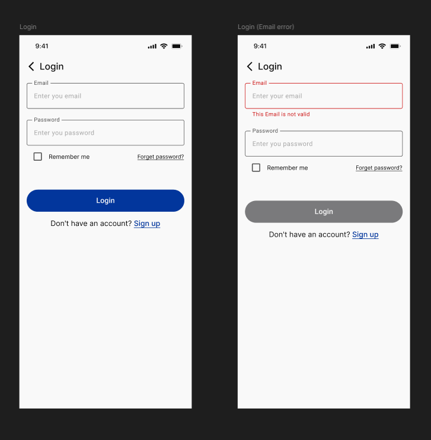
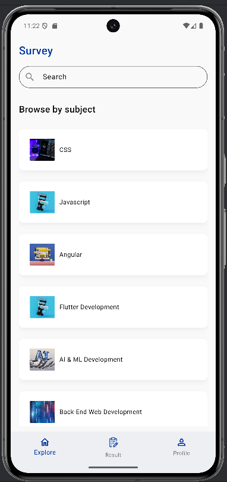
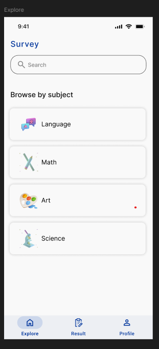
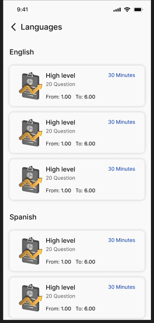
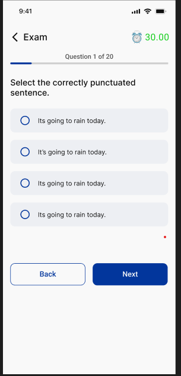
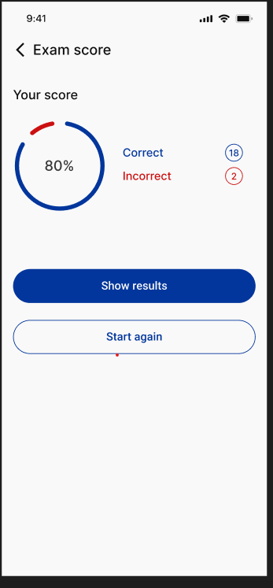
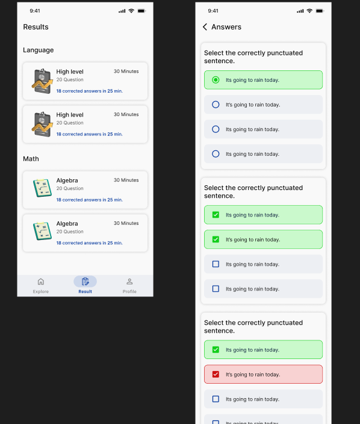
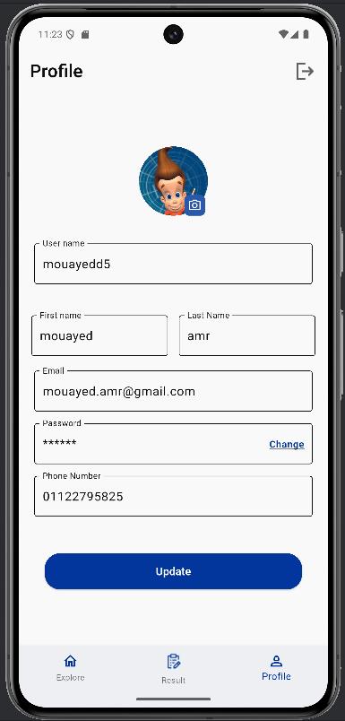

📘 Online Exam App Elevate

An Online Exam Application built with Flutter. The app allows users to create an account, browse subjects, attempt exams with timers, and view their scores history. It is designed with Clean Architecture and modern Flutter development practices.

Demo Link: https://streamable.com/zkhp02

🚀 Features

🔑 Authentication – Signup & Login with token-based authentication.

🏠 Home Page – Browse & search subjects.

📚 Subject Selection – Pick a subject and exam level.

📝 Exam Page – Attempt exams with a countdown timer.

📊 Final Score – Instant result after submission.

📑 Result Page – View all your past exam scores.

👤 Profile Screen – Update personal information.

Users can sign up or log in to access the app.

All requests are authenticated using a secure token.

🏠 Home Page

After logging in, users are redirected to the Home Page.

Browse or search for subjects easily.

📚 Subject Selection

Choose your desired subject from the list.

Filter or search to quickly find what you need.

📝 Exam Selection

Select an exam within the subject.

Choose the exam level (Beginner, Intermediate, Advanced).

⏱️ Exam with Timer

Once you start, a timer is displayed.

Complete the exam before time runs out.

📊 Final Score

After submission, the app calculates and shows your final score instantly.

Get feedback on performance.

📑 Result Page

View a history of all your scores in one place.

Track your progress across multiple subjects and exams.

👤 Profile Screen

Update your personal information (name, email, etc.).

Profile details are securely stored and synced using token-based authentication.

🛠️ Tech Stack

Architecture: Clean Architecture

Design Pattern: Repository Pattern

State Management: Cubit + MVVM

Networking: Dio + Retrofit

Dependency Injection: Injectable

Authentication: Token-based Authentication

📌 Future Improvements

Add Leaderboards & Ranking System

Support for Offline Mode

Detailed Exam Analytics

⚡ Getting Started

Follow these steps to run the app locally:

# 1. Clone the repository
git clone https://github.com/moyasser20/online_exam_app_elevate.git

# 2. Navigate to the project folder
cd online_exam_app_elevate

# 3. Install dependencies
flutter pub get

# 4. Run the app
flutter run

👨‍💻 Team

This project was developed under Elevate Tech Company by:

Mohamed Yasser

Mouayed Amr
